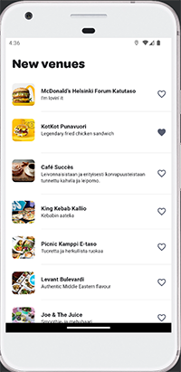

## Author
Karoliina Multas

## Introduction
This is a pre-assignment for the Wolt Summer 2023 Engineering Internships position.
#### Features
 The application uses Wolt API together with the user's current location to show a maximum of 15 venues nearby. When the application is opened for the first time, it will ask permission to use the device location information. It then applies the latitude and longitude to the URL parameters and fetches the nearest venues. Each venue has a "Favorite" action, and it works as a toggle. If the application is closed and reopened again, it remembers the ones that are marked as favorites.
#### Language and libraries
The application is written in Kotlin and uses Android Jetpack Compose toolkit. It also uses Retrofit and Kotlinx Serialization libraries for handling HTTP requests. The true/false value of the "Favorite" venue is saved using SharedPreferences with its venue id. 

## What do you need
- Android Studio
- Working internet connection
- Android device or an emulator

## How to use
- Open the project in Android Studio
- If you are using an emulator, go to the Extended Controls and set the device location somewhere in Helsinki.
- Build the project and run it.
- When the application asks permission to use your location, allow it.
